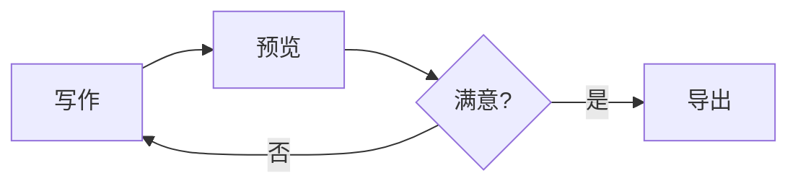

# Mermaid 图表

在 ```` ```mermaid ```` 代码围栏中书写 Mermaid 语法，预览会渲染为矢量图表。支持 Mermaid 的全部图表类型：流程图、时序图、甘特图、状态图、类图、饼图等。

## 基本用法

````markdown

````

## 快速插入

不想手写语法时，有三个入口可以插入带模板的代码块，改改文字即可成图：

- 斜杠命令：`/mermaid`（流程图）、`/sequence`（时序图）、`/gantt`（甘特图）、`/state`（状态图）、`/class`（类图）；
- 工具栏「图表」按钮；
- 右键菜单「插入」。

## 行为细节

- **主题跟随**：图表配色自动跟随应用明暗主题，切换主题时已渲染的图表会重绘；
- **懒加载**：距离视口较远的图表暂不渲染，长文档滚动更流畅；
- **语法错误**：显示「图表语法错误」提示与源码，方便定位；
- **安全渲染**：以严格模式渲染，不执行图表内的 HTML 标签。

## 与演示模式配合

Mermaid 图表在[演示模式](/guide/view-modes#演示模式)中同样渲染，可直接把带图表的文档变成全屏幻灯片。

## 下一步

- [Markmap 思维导图](/guide/markmap) —— 更简单的导图：只写标题层级
- [工作流查看器](/guide/workflow-viewer) —— GitHub Actions 工作流可视化
